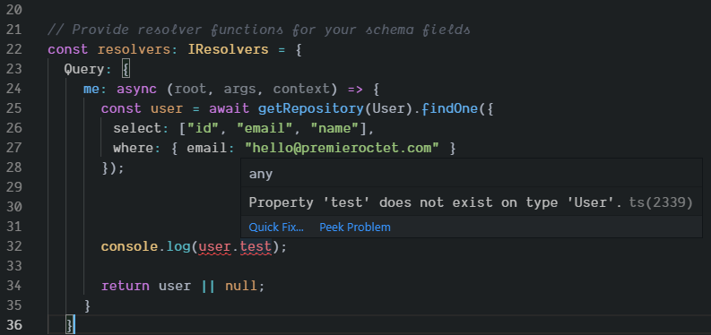
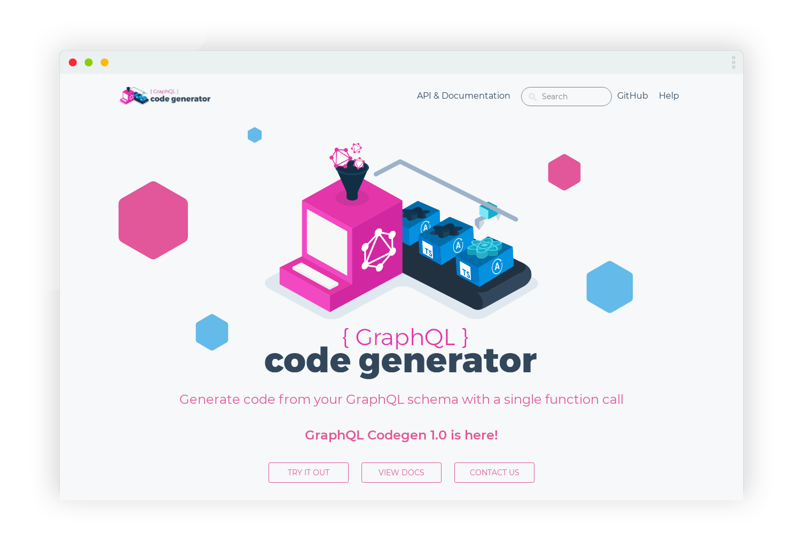

import { Image, Notes } from "mdx-deck"
import { syntaxHighlighterPrism } from "mdx-deck/themes"
import { Split } from "mdx-deck/layouts"

import customTheme from "./theme"
export const themes = [customTheme, syntaxHighlighterPrism]

## Typage de bout en bout avec TypeScript et GraphQL

Meetup GraphQL Paris

Juillet 2019

---

## Me 🤓

<Split>

```graphql
{
  me {
    name
    job
    company {
      name
      website
    }
    networks {
      name
      url
    }
  }
}
```

<div style={{ marginLeft: 50, width: "15em" }}>

```json
{
  "me": {
    "name": "Thibault Lenclos 🎸🚴‍",
    "job": "Développeur React+Native",
    "company": {
      "name": "Premier Octet",
      "website": "https://premieroctet.com"
    },
    "networks": [
      {
        "name": "Twitter",
        "url": "https://twitter.com/thibz"
      },
      {
        "name": "Github",
        "url": "https:/github.com/tlenclos"
      }
    ]
  }
}
```

</div>

</Split>

---

## Premier Octet


---

## Pourquoi typer son application

- 📚 Documentation "automatique" du code
- ✅ Détecter les erreurs
- ⛑ Se sentir en sécurité, confiant
- 😌 Écrire moins de tests

---

## GraphQL ?


---

## GraphQL ? 💉 de rappel

- API typée avec un schéma
- Indépendant de la base de données
- On récupère l'information via des "Query"
- On met à jour via des "Mutation"

---

## GraphQL: Schema

```graphql
type Query {
  me: User
}

type User {
  id: ID
  name: String
}
```

Fortemment typé ! Pas de type générique "object".

---

## GraphQL: Resolvers

```js
function Query_me(request) {
  return request.auth.user
}

function User_name(user) {
  return user.getName()
}
```

Fonctions responsables de résoudre les champs de votre schéma.

---

## GraphQL: Query

➡ Query

```graphql
{
  me {
    name
  }
}
```

⬅ Réponse

```json
{
  "me": {
    "name": "Thibault Lenclos"
  }
}
```

---

## GraphQL: Mutation

➡ Mutation

```graphql
mutation UpdateUser($userId: ID!, $name: String!) {
  updateUser(userId: $userId, name: $name) {
    name
  }
}
```

⬅ Réponse

```json
{
  "updateUser": {
    "name": "Thibault Lenclos"
  }
}
```

La validation du type est automatique par le serveur.

---

## Comment typer en JavaScript

- **Flow** ou **TypeScript**
- Ajoute une nouvelle étape de compilation
- Typage statique (!= runtime)

---

## TypeScript ?


(almost) no more undefined.

---

## TypeScript: premier test

```bash
yarn global add typescript

touch index.ts

tsc -w index.ts
```

---

## Exemple

```ts
type Speaker = {
  name: string
  job?: string
  hasCat?: boolean
}

const user: Speaker = {
  name: "Thibault Lenclos",
  job: "Web & mobile developer",
}
```

---

## Exemple

Ajoutons une propriété à notre utilisateur

```ts
type Speaker = {
  name: string
  job?: string
  hasCat?: boolean
}

const user: Speaker = {
  name: "Thibault Lenclos",
  job: "Web & mobile developer",
  location: "Paris",
}
```

---

## Compilation

```bash
test.ts:10:3 - error TS2322: Type '{ name: string; job: string; location: string; }' is not assignable to type 'Speaker'.
  Object literal may only specify known properties, and 'location' does not exist in type 'Speaker'.

10   location: "Paris"
     ~~~~~~~~~~~~~~~~~

```

---

## Démo

- Serveur Node.js
  - GraphQL avec Apollo Server
  - TypeORM
- Front
  - Apollo client
  - React

et l'outil [GraphQL Codegen](https://graphql-code-generator.com/) 👌

---

## Typage ORM

TypeORM est un ORM en TypeScript utilisant les dernières fonctionnalités du langage.

```ts
import { Entity, PrimaryGeneratedColumn, Column } from "typeorm"

@Entity()
export class User {
  @PrimaryGeneratedColumn()
  id: number

  @Column()
  email: string

  @Column()
  name: string

  @Column({ nullable: true })
  job: string
}
```

---

## Récupération des données

L'ORM nous assure un premier rempart contre les erreurs



---

## Exposer les données

Définir le schéma et les query.

```
import { gql } from 'apollo-server-express'

const User = gql`
  type User {
    id: Int!
    email: String!
    name: String
  }

  extend type Query {
    me: User!
  }
`

export default User
```

---

## Génération de types

TypeORM permet d'utiliser TypeScript pour nos entités.

GraphQL permet de de typer notre API.

Ces 2 briques ne se connaissent pas ⚠️.

---

## GraphQL Codegen

Outil de génération de types TypeScript à partir d'un schéma GraphQL.



---

## Codegen config

Fichier de configuration pour spécifier ce que l'on souhaite générer.

```yaml
# codegen.yaml
schema: https://xp3wwv5lyo.sse.codesandbox.io/
generates:
  server-types.d.ts:
    - typescript
    - typescript-resolvers
```

```ts
// server-types.d.ts
export type UserResolvers<
  Context = any,
  ParentType = User
> = ResolversObject<{
  id?: Resolver<Int, ParentType, Context>
  email?: Resolver<string, ParentType, Context>
  name?: Resolver<Maybe<string>, ParentType, Context>
}>

export type Resolvers<Context = any> = ResolversObject<{
  Query?: QueryResolvers<Context>
  User?: UserResolvers<Context>
}>
```

---

## Apollo server

- Serveur GraphQL avec Node.js
- Open source
- Documenté avec de nombreux exemples
- Associé avec un client (Apollo client) pour le front

---

## Apollo server

```ts
const apolloServer = new ApolloServer({
  typeDefs: schema,
  resolvers,
})

db.then(() => {
  apolloServer.listen().then(() => {
    console.log(`🚀 Server ready`)
  })
})
```

---

## Et côté front ?

```yaml
# codegen.yaml
schema: https://xp3wwv5lyo.sse.codesandbox.io/
documents:
  - "src/graphql/**/*.{ts,tsx}"
generates:
  src/generated/graphql.tsx:
    config:
      noNamespaces: true
      noComponents: true
      withHooks: true
    plugins:
      - typescript-common
      - typescript-client
      - typescript-react-apollo
```

Génération de types et de composants React par rapport au schéma consommé.

---

## Type fatigue 😩

Typer des composants React à la main devient vite complexe.

```tsx
// src/generated/graphql.tsx
export function GetUserHOC<TProps, TChildProps = any>(
  operationOptions:
    | ReactApollo.OperationOption<
        TProps,
        GetUserQuery,
        GetUserVariables,
        GetUserProps<TChildProps>
      >
    | undefined
) {
  return ReactApollo.graphql<
    TProps,
    GetUserQuery,
    GetUserVariables,
    GetUserProps<TChildProps>
  >(GetUserDocument, operationOptions)
}

export function useGetUser(
  baseOptions?: ReactApolloHooks.QueryHookOptions<GetUserVariables>
) {
  return ReactApolloHooks.useQuery<GetUserQuery, GetUserVariables>(
    GetUserDocument,
    baseOptions
  )
}
```

Généré automatiquement 👌.

---

## Utilisation

```tsx
// UserComponent.tsx
import React from "react"
import { useGetUser, GetUserMe } from "./generated/graphql"

// Props are typed according to GraphQL query
type UserProps = {
  user: GetUserMe
}

// Components are typed with props definition
const UserComponent = ({ user }: UserProps) => (
  <p>Hello {user.name}</p>
)

export default () => {
  // react-apollo hook, we got autocompletion for data and graphql variables here
  const { data, loading } = useGetUser()

  return (
    <div className="App">
      <header className="App-header">
        {/** Accessing an undefined key here will break the build */}
        {loading && <p>"Loading"</p>}
        {data && data.me && <UserComponent user={data.me} />}
      </header>
    </div>
  )
}
```

---

<iframe
  src="https://codesandbox.io/embed/69ny88orz?fontsize=14"
  title="Apollo Client TS"
  allow="geolocation; microphone; camera; midi; vr; accelerometer; gyroscope; payment; ambient-light-sensor; encrypted-media"
  style={{
    width: "90%",
    height: "90%",
    border: 0,
    overflow: "hidden",
    position: "absolute",
    top: 0,
    left: "5%",
  }}
  sandbox="allow-modals allow-forms allow-popups allow-scripts allow-same-origin"
/>

---

## Résumons

- ♻️ Modification du schéma ===  mise à jour des types pour le serveur et le client
- ⚠️ Le serpent peut se mordre la queue, le type `any` peut vous sauver
- 💅 Une incompatiblité entre le schéma GraphQL et son utilisation front cassera le build !

---

## On recrute

[https://www.premieroctet.com/jobs](https://www.premieroctet.com/jobs)


---

## Questions ?

---

## Références

- [GraphQL Codegen](https://graphql-code-generator.com)
- [Démo serveur](https://codesandbox.io/s/xp3wwv5lyo)
- [Démo client](https://codesandbox.io/s/69ny88orz)
